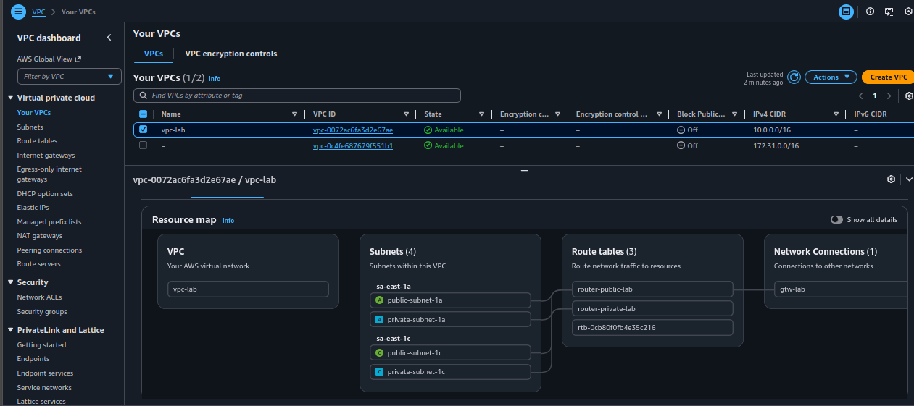
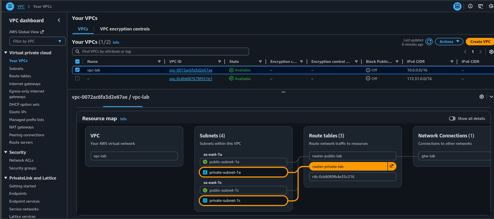

# Lab 001 - VPC Infrastructure on AWS using Terraform

## 🚀 Introduction

This guide provides step-by-step instructions on how to set up a Virtual Private Cloud (VPC) on Amazon Web Services (AWS) utilizing Terraform scripts. The infrastructure includes essential components such as subnets, internet gateway, route tables, and security groups for network access management.


## 📋 Prerequisites

- **Terraform:** Ensure Terraform is installed on your system. You can download it from [Terraform.io](https://www.terraform.io/downloads.html).
- **AWS Account:** A valid AWS account to create and manage resources.
- **Access Credentials:** AWS credentials configured locally. Usually, this is done using AWS CLI with `aws configure`.
- **Region:** AWS region is configured to `sa-east-1` (São Paulo) by default.


## ⚙️ Infrastructure Components


## Overview

This Terraform script automates the provisioning of a Virtual Private Cloud (VPC) infrastructure in AWS. It creates
both public and private subnets, an internet gateway, a public route table, and a security group with rules for web
and SSH access.

### ☁️ 1. VPC Creation

The VPC is a logically isolated section of the AWS cloud. It allows you to launch AWS resources in a virtual network that you define.

```hcl
resource "aws_vpc" "vpc" {
  cidr_block = var.vpc_cidr_block
  tags = {
    Name = "vpc-${local.tag_enviromnent}"
  }
}
```
- **Resource:** [`aws_vpc`](https://registry.terraform.io/providers/hashicorp/aws/latest/docs/resources/vpc)
- **CIDR Block:** Defines the IP range for the VPC (default: `10.0.0.0/16`), configurable via `var.vpc_cidr_block`.
- **Tags:** A `Name` tag is applied for easy identification, leveraging the environment tag defined as `${local.tag_environment}` (default: "lab")

### ☁️ 2. Internet Gateway

An Internet Gateway is required for internet access. It allows resources in your VPC to communicate with the internet.

```hcl
resource "aws_internet_gateway" "gw" {
  vpc_id = aws_vpc.vpc.id

  tags = {
    Name = "gtw-${local.tag_enviromnent}"
  }
}
```
- **Resource:** [`aws_internet_gateway`](https://registry.terraform.io/providers/hashicorp/aws/latest/docs/resources/internet_gateway)
- **Associates** with the VPC to enable internet access.
- **Tags:** Named with the pattern `gtw-${local.tag_environment}` for tracking and organization.

### ☁️ 3. Route Tables

Two route tables are created: one for public subnets and one for private subnets.

**3.1 Public Route Table**

```hcl
resource "aws_route_table" "router-public" {
  vpc_id = aws_vpc.vpc.id

  route {
    cidr_block = "0.0.0.0/0"
    gateway_id = aws_internet_gateway.gw.id
  }

  tags = {
    Name = "router-public-${local.tag_enviromnent}"
  }
}
```
- **Resource:** [`aws_route_table`](https://registry.terraform.io/providers/hashicorp/aws/latest/docs/resources/route_table)
- **Purpose:** Routes internet traffic to and from the VPC via the internet gateway.
- **Routes:** Implements a route allowing traffic to `0.0.0.0/0` (all internet addresses) through the internet gateway.
- **Tags:** Named with pattern `router-public-${local.tag_environment}` for organization.

**3.2 Private Route Table**

```hcl
resource "aws_route_table" "router-private" {
  vpc_id = aws_vpc.vpc.id

  tags = {
    Name = "router-private-${local.tag_enviromnent}"
  }
}
```
- **Resource:** [`aws_route_table`](https://registry.terraform.io/providers/hashicorp/aws/latest/docs/resources/route_table)
- **Purpose:** Routes traffic for private subnets (without direct internet access by default).
- **Tags:** Named with pattern `router-private-${local.tag_environment}` for organization.

### ☁️ 4. Subnets

Subnets divide the VPC into smaller, isolated network segments. This infrastructure creates both private and public subnets across multiple availability zones.

**4.1 Private Subnets**

```hcl
resource "aws_subnet" "private-subnet" {
  for_each = var.private-subnets

  vpc_id            = aws_vpc.vpc.id
  cidr_block        = each.value.cidr_block
  availability_zone = each.value.availability_zone
  tags = {
    Name = each.key
  }
}
```
- **Resource:** [`aws_subnet`](https://registry.terraform.io/providers/hashicorp/aws/latest/docs/resources/subnet) (Private)
- **Purpose:** Hosts resources that should not be accessible directly from the internet.
- **Configuration:**
  - Uses a `for_each` loop to create subnets based on provided `var.private-subnets`.
  - Associates with the VPC and specifies `cidr_block` and `availability_zone` per subnet.
- **Default Configuration:**
  - `private-subnet-1a`: `10.0.0.0/24` in `sa-east-1a`
  - `private-subnet-1c`: `10.0.1.0/24` in `sa-east-1c`

**4.2 Public Subnets**

```hcl
resource "aws_subnet" "public-subnet" {
  for_each = var.public-subnets

  vpc_id                  = aws_vpc.vpc.id
  cidr_block              = each.value.cidr_block
  availability_zone       = each.value.availability_zone
  map_public_ip_on_launch = true
  tags = {
    Name = each.key
  }
}
```
- **Resource:** [`aws_subnet`](https://registry.terraform.io/providers/hashicorp/aws/latest/docs/resources/subnet) (Public)
- **Purpose:** Hosts resources accessible from the internet, like web servers.
- **Key Feature:** `map_public_ip_on_launch = true` automatically assigns public IPs to instances launched in these subnets.
- **Default Configuration:**
  - `public-subnet-1a`: `10.0.2.0/24` in `sa-east-1a`
  - `public-subnet-1c`: `10.0.3.0/24` in `sa-east-1c`

### ☁️ 5. Route Table Associations

Route table associations link subnets to their respective route tables, determining how traffic is routed.

```hcl
resource "aws_route_table_association" "associate_route_table_private" {
  for_each       = aws_subnet.private-subnet
  subnet_id      = each.value.id
  route_table_id = aws_route_table.router-private.id
}

resource "aws_route_table_association" "associate_route_table_public" {
  for_each       = aws_subnet.public-subnet
  subnet_id      = each.value.id
  route_table_id = aws_route_table.router-public.id
}
```
- **Resource:** [`aws_route_table_association`](https://registry.terraform.io/providers/hashicorp/aws/latest/docs/resources/route_table_association)
- **Function:** Ensures each subnet is associated with the correct route table.
- **Configuration:** Uses `for_each` to iterate through private and public subnets respectively.
- **Effect:** 
  - Private subnets route traffic through the private route table (no internet access by default).
  - Public subnets route internet traffic through the public route table and internet gateway.

### 🛡️ 6. Security Group

A Security Group acts as a virtual firewall controlling inbound and outbound traffic to AWS resources.

```hcl
resource "aws_security_group" "lab_sg_default" {
  name        = "sg_default-${local.tag_environment}"
  description = "Allow WEB inbound traffic and all outbound traffic"
  vpc_id      = aws_vpc.vpc.id

  tags = {
    Name = "sg_default_${local.tag_environment}"
  }
}
```
- **Resource:** [`aws_security_group`](https://registry.terraform.io/providers/hashicorp/aws/latest/docs/resources/security_group)
- **Purpose:** Controls inbound and outbound traffic for resources in the VPC.
- **Name:** Follows the pattern `sg_default-${local.tag_environment}` (default: `sg_default-lab`).
- **Description:** Allows all internal traffic between resources in the same security group and unrestricted outbound access.

#### Ingress Rule (Internal Communication)

```hcl
resource "aws_vpc_security_group_ingress_rule" "allow_from_sg_default" {
  security_group_id            = aws_security_group.lab_sg_default.id
  from_port                    = 0
  ip_protocol                  = "-1"
  to_port                      = 0
  referenced_security_group_id = aws_security_group.lab_sg_default.id
}
```
- **Resource:** [`aws_vpc_security_group_ingress_rule`](https://registry.terraform.io/providers/hashicorp/aws/latest/docs/resources/vpc_security_group_ingress_rule)
- **Purpose:** Allows all traffic between resources in the same security group.
- **Configuration:**
  - `ip_protocol = "-1"` means all protocols.
  - `from_port = 0` and `to_port = 0` encompasses all ports.
  - `referenced_security_group_id` allows traffic from other instances in the same security group.

#### Egress Rule (Outbound Traffic)

```hcl
resource "aws_vpc_security_group_egress_rule" "allow_all_traffic_ipv4" {
  security_group_id = aws_security_group.lab_sg_default.id
  cidr_ipv4         = "0.0.0.0/0"
  ip_protocol       = "-1"
}
```
- **Resource:** [`aws_vpc_security_group_egress_rule`](https://registry.terraform.io/providers/hashicorp/aws/latest/docs/resources/vpc_security_group_egress_rule)
- **Purpose:** Allows unrestricted outbound access to any destination.
- **Configuration:**
  - `cidr_ipv4 = "0.0.0.0/0"` allows traffic to all IPv4 addresses.
  - `ip_protocol = "-1"` allows all protocols on all ports.

## � Project Structure

```
infra/
├── provider.tf          # AWS provider configuration (region: sa-east-1)
├── main.tf              # Main infrastructure resources (VPC, subnets, routes, security group)
├── variables.tf         # Input variables (VPC CIDR, subnets configuration)
├── locals.tf            # Local variables (tag_environment: "lab")
├── outputs.tf           # Output values (VPC ID, subnet IDs, security group)
├── data.tf              # Data sources for additional configurations (if applicable)
└── versions.tf          # Terraform and provider version constraints
```

## 🔧 Variables and Defaults

### Input Variables (`variables.tf`)

| Variable | Type | Default | Description |
|----------|------|---------|-------------|
| `regiao` | string | `sa-east-1` | AWS region for resource deployment |
| `vpc_cidr_block` | string | `10.0.0.0/16` | CIDR block for the VPC |
| `private-subnets` | map | See below | Private subnet configurations |
| `public-subnets` | map | See below | Public subnet configurations |

#### Private Subnets Configuration
- `private-subnet-1a`: CIDR `10.0.0.0/24` in availability zone `sa-east-1a`
- `private-subnet-1c`: CIDR `10.0.1.0/24` in availability zone `sa-east-1c`

#### Public Subnets Configuration
- `public-subnet-1a`: CIDR `10.0.2.0/24` in availability zone `sa-east-1a`
- `public-subnet-1c`: CIDR `10.0.3.0/24` in availability zone `sa-east-1c`

### Local Variables (`locals.tf`)

| Variable | Value | Usage |
|----------|-------|-------|
| `tag_environment` | `lab` | Used in naming resources (e.g., `vpc-lab`, `sg_default-lab`) |

## 📤 Outputs

The infrastructure exposes the following outputs (`outputs.tf`):

- **vpc**: The ID of the VPC
- **private-subnets**: List of private subnet IDs
- **public-subnets**: List of public subnet IDs
- **security_group_id_web**: The security group resource (lab_sg_default)

## 📦 Deployment Guide

### Step-by-Step Instructions

1. **Navigate to the Infrastructure Directory**
   ```bash
   cd infra/
   ```

2. **Initialize Terraform**: Run `terraform init` to download provider plugins and initialize the working directory.
   ```bash
   terraform init
   ```

3. **Review the Plan**: Use `terraform plan` to preview the resources that will be created.
   ```bash
   terraform plan
   ```

4. **Apply the Configuration**: Execute `terraform apply` to create the VPC infrastructure in AWS.
   ```bash
   terraform apply
   ```
   - Review the proposed changes and type `yes` to confirm.

5. **Verify Outputs**: After successful deployment, Terraform will display the output values (VPC ID, Subnet IDs, etc.).
   ```bash
   terraform output
   ```

### Example Commands Sequence

```bash
cd infra/
terraform init
terraform plan
terraform apply
terraform output
```

### Destroying the Infrastructure

To tear down all resources created by Terraform:

```bash
terraform destroy
```
- Review the resources to be destroyed and type `yes` to confirm.

## ⚠️ Important Notes

- **State Management**: The `terraform.tfstate` file tracks the infrastructure state. Ensure it's backed up and not committed to version control (use `.gitignore`).
- **Region**: The default region is `sa-east-1` (São Paulo). Modify `var.regiao` if you need a different AWS region.
- **Availability Zones**: Subnets are distributed across `sa-east-1a` and `sa-east-1c` for high availability.
- **Security**: The default security group allows all internal traffic and unrestricted outbound access. Adjust ingress rules as needed for your use case.
- **Customization**: Override default values using `.tfvars` files or CLI variables:
  ```bash
  terraform apply -var="regiao=us-east-1" -var="vpc_cidr_block=172.16.0.0/16"
  ```
## 📺 AWS Console Verification

After deploying the infrastructure, verify the created resources in the AWS Console:

### 1. VPC Overview
Navigate to the VPC dashboard to view the overall infrastructure including the VPC, subnets, and route tables.



**What to verify:**
- VPC CIDR block: `10.0.0.0/16`
- All four subnets created (2 public, 2 private)
- Internet gateway attached

### 2. Public Route Table Configuration
Check the public route table associations and routing rules.


**Key points:**
- **Subnets Associated:** `public-subnet-1a` and `public-subnet-1c`
- **Route Table:** `router-public-lab`
- **Routes:**
  - `10.0.0.0/16` → Local (VPC internal traffic)
  - `0.0.0.0/0` → `gtw-lab` (Internet Gateway for external access)

### 3. Private Route Table Configuration
Verify the private route table has no internet gateway route, restricting direct internet access.



**Key points:**
- **Subnets Associated:** `private-subnet-1a` and `private-subnet-1c`
- **Route Table:** `router-private-lab`
- **Routes:**
  - `10.0.0.0/16` → Local (VPC internal traffic only)
  - No internet gateway route (no direct internet access by default)


## 🎯 Summary

This VPC infrastructure provides a robust foundation for AWS deployments with:
- **High Availability**: Resources distributed across multiple availability zones
- **Network Segmentation**: Separate public and private subnets for security
- **Internet Connectivity**: Internet gateway for public subnet resources
- **Flexible Configuration**: Variables allow easy customization of CIDR blocks and regions
- **Internal Communication**: Security group enables resource-to-resource communication within the VPC

## Troubleshooting

- **Provider Issues**: Ensure AWS CLI credentials are configured correctly with `aws configure`.
- **Region Errors**: Verify that the specified region is available and that your AWS account has access.
- **State Conflicts**: If state errors occur, check that no other Terraform processes are running against the same state.
- **Resource Limits**: Verify that your AWS account has sufficient quotas for EC2 resources.

## 🔗 References
* [Terraform Language Documentation](https://developer.hashicorp.com/terraform/language)
* [Terrform Provider AWS](https://registry.terraform.io/providers/hashicorp/aws/latest)
* [Terraform workflow for provisioning infrastructure](https://developer.hashicorp.com/terraform/cli/run)
---

